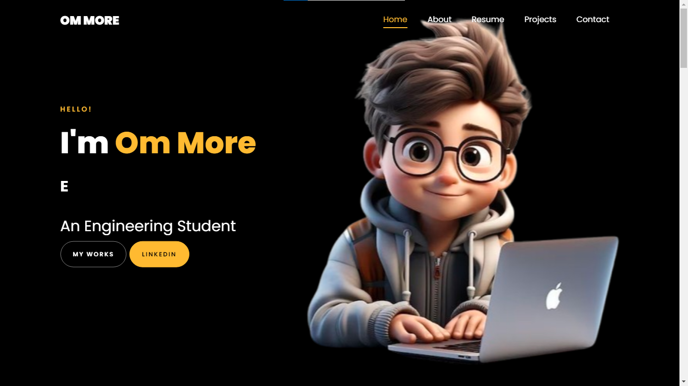

# 📄 PORTFOLIO WEBSITE

Welcome to my **personal portfolio website**! This site serves as a digital resume where I showcase my projects, skills, interests, and journey as an AI & Data Science Engineering student. It’s built to reflect my personality, passion for tech and continuous learning.

<h2>🔍 Overview</h2>
This website includes:<br>
✨ Introduction & bio<br>
📚 Skills and technologies I’m proficient in<br>
🎓 Education and achievements<br>
🛠️ Projects with live links & GitHub repositories<br>
📄 Resume<br>
📫 Contact form to reach me directly<br>
<br>
Whether you're a recruiter, collaborator, or curious visitor, this site gives you a quick insight into who I am and what I love to build.<br>

<h2>🧰 Tech Stack</h2>
Frontend: React.js, Vite, TailwindCSS<br>
Animations & Icons: Framer Motion, React Icons<br>
Hosting: GitHub Pages / Vercel / Netlify<br>

<h2>🚀 Live Demo</h2>

[Click Here](https://portfolio-website-om-more.vercel.app/) to view the portfolio website live!

<h2>📷 Screenshots</h2>


<br>

<h2>🛠️ How to Run Locally</h2>

```bash
git clone https://github.com/ommore86/Portfolio-Website.git
cd Portfolio-Website
npm install
npm run dev
```

<h2>🤝 Let's Connect!</h2>

If you’d like to collaborate, give feedback, or just say hi — don’t hesitate to reach out or connect with me on [LinkedIn](https://www.linkedin.com/in/om-more-b802b2281/).
